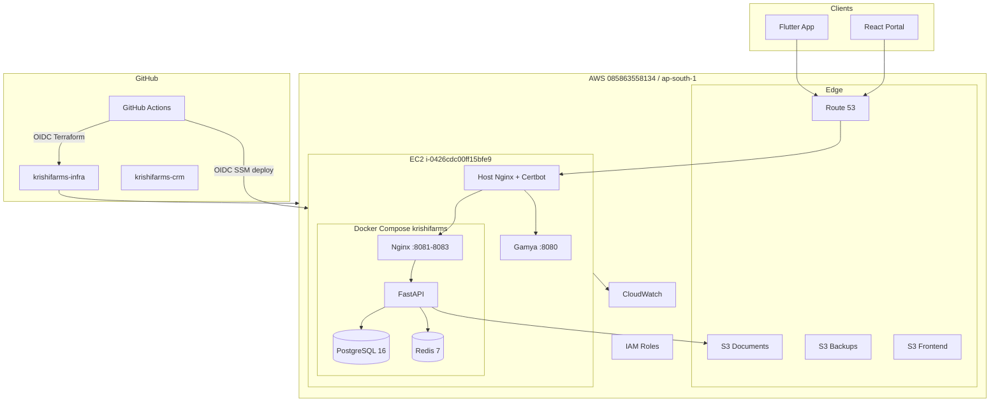

# Architecture — KrishiFarms CRM Infrastructure

Deep technical reference. For agent quick context see [AGENTS.md](../AGENTS.md). For doc maintenance see [DOCUMENTATION.md](DOCUMENTATION.md).

---

## 1. System context



---

## 2. Design goals

| Goal | Implementation |
|------|----------------|
| Minimize cost | Single shared EC2 with Gamya; no RDS/NAT/ALB |
| Reuse existing compute | `data.aws_instance` — no `aws_instance` |
| Simple ops | Docker Compose, shell scripts, SSM |
| IaC | Terraform modules per AWS service |
| CI/CD | GitHub OIDC (Gamya pattern) |
| Multi-env | dev / qa / prod Terraform roots |
| Agent-friendly | AGENTS.md + docs/ + Cursor rules |

---

## 3. Repository layers

### Layer 1 — Bootstrap (once per account)

| Resource | Name | Purpose |
|----------|------|---------|
| S3 | `krishifarms-terraform-state` | Remote Terraform state |
| DynamoDB | `terraform-locks` | State locking (shared with Gamya) |
| IAM role | `KrishiFarmsGitHubTerraformRole` | GitHub → Terraform OIDC |

### Layer 2 — Environment stacks

Each of `environments/{dev,qa,prod}` is an independent root module:

| Module | dev | qa | prod |
|--------|-----|-----|------|
| s3 | ✓ | ✓ | ✓ |
| iam (EC2 profile) | ✓ | ✓ | ✓ |
| security-groups | ✓ | ✓ | ✓ |
| cloudwatch | ✓ | ✓ | ✓ |
| route53 zone | — | — | ✓ |
| route53 records | ✓ | ✓ | ✓ |
| acm | — | — | ✓ |
| backend-deploy-s3 | ✓ | — | — |
| ci-backend-deploy-iam | ✓ | — | — |

### Layer 3 — Runtime (EC2)

Not Terraform-managed after initial IAM/SG attachment:

| Path | Contents |
|------|----------|
| `/opt/krishifarms/app/` | docker-compose files |
| `/opt/krishifarms/config/` | `.env`, `host.env` |
| `/opt/krishifarms/data/` | Postgres + Redis volumes |
| `/opt/krishifarms/scripts/` | deploy, backup, health |
| `/opt/krishifarms/logs/` | nginx, backup logs |

---

## 4. Network and traffic

### Shared EC2 port allocation

| Port | Owner | Bind address |
|------|-------|--------------|
| 80 / 443 | Host nginx | `0.0.0.0` (public) |
| 8080 | Gamya Docker/systemd | `127.0.0.1` |
| 8081 | KrishiFarms prod nginx | `127.0.0.1` |
| 8082 | KrishiFarms dev nginx | `127.0.0.1` |
| 8083 | KrishiFarms qa nginx | `127.0.0.1` |
| 5432 | PostgreSQL | Docker internal only |
| 6379 | Redis | Docker internal only |

### TLS

- **Termination:** Host nginx (Certbot / Let's Encrypt)
- **Container nginx:** HTTP only, localhost
- **Prod domain:** `api.krishifarms.in`
- **Dev domain:** `dev.api.krishifarms.in`

---

## 5. Data flow

### API request (KrishiFarms prod)

```
Client HTTPS → Route53 A record (13.232.200.243)
  → Host nginx :443 (krishifarms.conf, server_name api.krishifarms.in)
    → 127.0.0.1:8081 (Docker nginx)
      → api:8000 (FastAPI)
        → postgres:5432 / redis:6379 / S3 (IAM role)
```

### Document upload

```
Client → FastAPI presigned URL → S3 krishifarms-{env}-documents-{account_id}
```

### Backup

```
cron 02:00 IST → backup-db.sh → pg_dump → gzip → S3 krishifarms-{env}-backups-{account_id}
  → CloudWatch metric BackupSuccess
```

### Deploy (CI)

```
krishifarms-crm push main
  → build Docker image → GHCR
  → upload deploy.env → S3 incoming/
  → SSM SendCommand → EC2
    → deploy.sh → pull image → alembic → health check
```

---

## 6. Terraform modules reference

| Module | Key outputs | Notes |
|--------|-------------|-------|
| `s3` | bucket names/ARNs | 4 buckets per env |
| `iam` | instance profile, deploy roles | EC2 S3 + SSM read |
| `security-groups` | ec2 SG id | HTTP/HTTPS only |
| `route53` | zone_id | prod only |
| `route53-records` | api FQDN | A → EIP |
| `acm` | certificate_arn | us-east-1 provider |
| `cloudwatch` | log groups, dashboard | 7-day retention prod |
| `ci-terraform-iam` | role_arn | bootstrap |
| `ci-backend-deploy-iam` | deploy_role_arn | dev |
| `backend-deploy-s3` | bucket_name | dev |
| `github-backend-deploy-config` | — | pushes to CRM repo |

---

## 7. IAM model

### Roles

| Role | Trust | Purpose |
|------|-------|---------|
| `KrishiFarmsGitHubTerraformRole` | GitHub OIDC `krishifarms-infra` | Terraform CI |
| `krishifarms-dev-gh-be-deploy-*` | GitHub OIDC `krishifarms-crm` | SSM deploy |
| `krishifarms-{env}-ec2-*` | EC2 service | S3, SSM params, CW logs |

### Shared EC2 note

One physical EC2 has **one instance profile**. Gamya and KrishiFarms policies must be **merged** on that profile — attach both S3 policy sets.

---

## 8. CI/CD architecture

### Infra pipeline

```
                    ┌─────────────┐
  PR → main ───────►│ Plan (dev)  │
                    └─────────────┘
  push → main ─────►│ Plan+Apply  │──► environments/dev state
                    └─────────────┘
  manual dispatch ─►│ Plan [+Apply with approval]
```

**Path filters:** `*.tf`, `*.tfvars`, `.github/workflows/terraform.yml`

### App pipeline (CRM repo)

See `examples/github-workflows/deploy-backend.yml`.

---

## 9. Environment comparison

| | dev | qa | prod |
|--|-----|-----|------|
| CI auto-apply | Yes | No | No |
| EC2 port | 8082 | 8083 | 8081 |
| force_destroy S3 | true | true | false |
| Log retention | 3d | 7d | 14d |
| Backend deploy IAM | Yes | No | Manual |
| Route53 zone create | No (data) | No | Yes |

---

## 10. Failure modes

| Symptom | Likely cause | Doc |
|---------|--------------|-----|
| Gamya 502 after Krishi install | Krishi used `default_server` | SHARED_EC2.md |
| Krishi 502 | Docker not up / wrong port | RUNBOOK.md |
| Terraform CI auth fail | Bootstrap role missing | GITHUB_ACTIONS.md |
| State lock | Interrupted apply | GITHUB_ACTIONS.md |
| Backup alarm | cron or S3 IAM | RUNBOOK.md |

---

## 11. Future scaling (document when implemented)

| Phase | Trigger | Change |
|-------|---------|--------|
| Vertical | CPU/RAM pressure | Resize EC2 |
| Dedicated EC2 | Gamya/Krishi conflict | `docker-compose.dedicated-ec2.yml` |
| Read replica | DB read load | Second Postgres streaming replica |
| Managed DB | 100+ users, user approval | RDS (ADR required) |

Update this section and `DECISIONS.md` when any phase is implemented.

---

## 12. Related docs

- [INDEX.md](INDEX.md) — full doc map
- [SHARED_EC2.md](SHARED_EC2.md) — coexistence with Gamya
- [GITHUB_ACTIONS.md](GITHUB_ACTIONS.md) — CI setup
- [DECISIONS.md](DECISIONS.md) — architecture decisions
- [CHANGELOG.md](CHANGELOG.md) — change history
